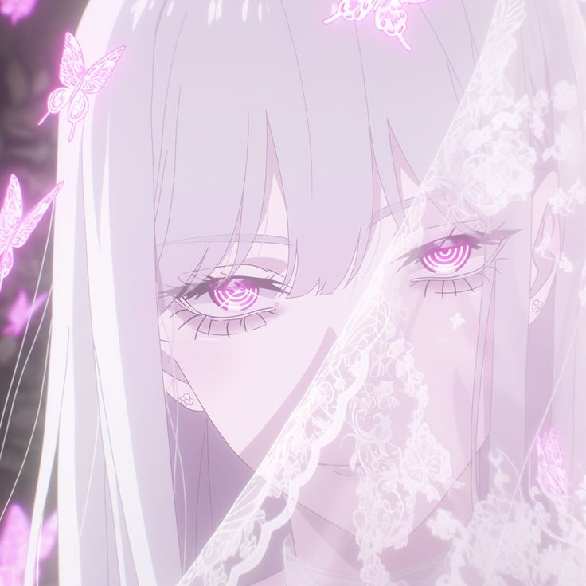

  

<h1 align="center" style="color:#f8c8dc;"> 闇に美を見つける|🌸 I'm Vika</h1>
<h3 align="center" style="color:#d3c2d3;">18 | College Student | Aspiring Web Designer | Coder in progress</h3>

💻 Learning: Python | C# | C++ | Web Design  
🎮 Gaming: Dota 2 | osu!  

---

## 🌸 About Me

- College student exploring the world of code & design ✨  
- Zero professional experience, 100% curiosity 💕  
- Love cute cats 🖤  

---

## 🖤 Skills

  
  
  
  
  
  
  

---

## 🎀 Fun & Hobbies

🎮 Gaming all day: Dota 2, osu!  
🌸 Making setups for coding & streaming

---

## 🐾 Stats

  
  

---

## 📬 Contact Me

  
  
  
  

