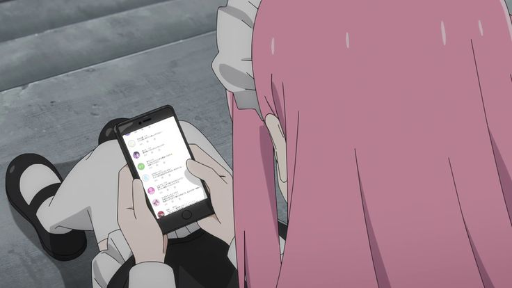

<!-- Аватарка -->

  

<h1 align="center" style="color:#f8c8dc;"> 闇に美を見つける|🌸 𝐈'𝐦 𝐕𝐢𝐤𝐚</h1>
<h3 align="center" style="color:#d3c2d3;">𝟏𝟖 | 𝐂𝐨𝐥𝐥𝐞𝐠𝐞 𝐒𝐭𝐮𝐝𝐞𝐧𝐭 | 𝐀𝐬𝐩𝐢𝐫𝐢𝐧𝐠 𝐖𝐞𝐛 𝐃𝐞𝐬𝐢𝐠𝐧𝐞𝐫 | 𝐂𝐨𝐝𝐞𝐫 𝐢𝐧 𝐩𝐫𝐨𝐠𝐫𝐞𝐬𝐬</h3>

💻 ʟᴇᴀʀɴɪɴɢ: ᴘʏᴛʜᴏɴ | ᴄ# | ᴄ++ | ᴡᴇʙ ᴅᴇꜱɪɢɴ  
🎮 ɢᴀᴍɪɴɢ: ᴅᴏᴛᴀ 𝟤 | ᴏꜱᴜ!  

---

## 🌸 𝐀𝐛𝐨𝐮𝐭 𝐌𝐞

  
   
  - College student exploring the world of code & design ✨  
  - Zero professional experience, 100% curiosity 💕  
  - Love cute cats 🩷  

---

## 🌺 𝐒𝐤𝐢𝐥𝐥𝐬

  
    
  
  
  
  
  
  
  

---

## 🎀 𝐅𝐮𝐧 & 𝐇𝐨𝐛𝐛𝐢𝐞𝐬

  
   
  🎮 Gaming all day: Dota 2, osu!  
  🌸 Making setups for coding & streaming

<pre align="center" style="color:#d3c2d3;">
‧₊˚ ✩°｡⋆♡ ⋆˙⟡♡ ⋆˙⟡♡⋆｡°✩˚₊‧
‧₊˚ ✩°｡⋆♡ ⋆˙⟡♡ ⋆˙⟡♡⋆｡°✩˚₊‧
‧₊˚ ✩°｡⋆♡ ⋆˙⟡♡ ⋆˙⟡♡⋆｡°✩˚₊‧
</pre>

---

## 🩷 𝐒𝐭𝐚𝐭𝐬
<h4 align="center" style="color:#f8c8dc;">GitHub Stats</h4>

  
    
  

---

## 📬 𝐂𝐨𝐧𝐭𝐚𝐜𝐭 𝐌𝐞

  
    
  
  
  
  

